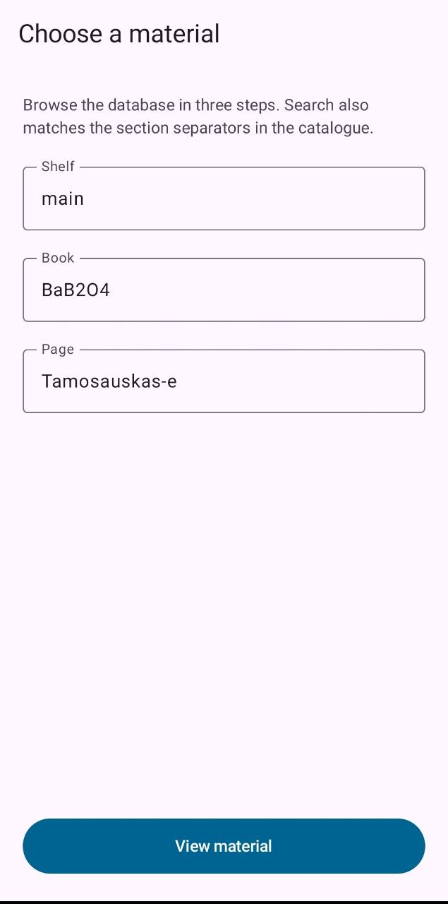
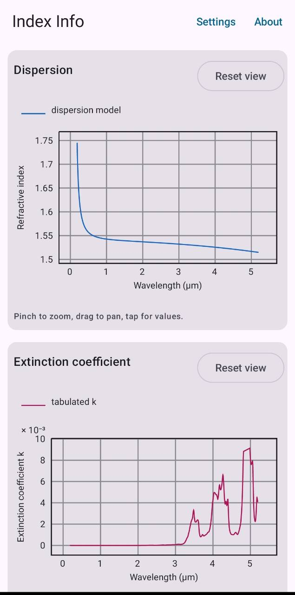
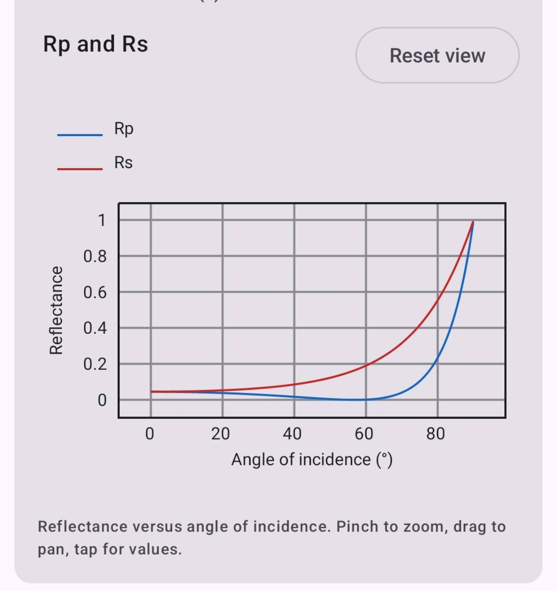
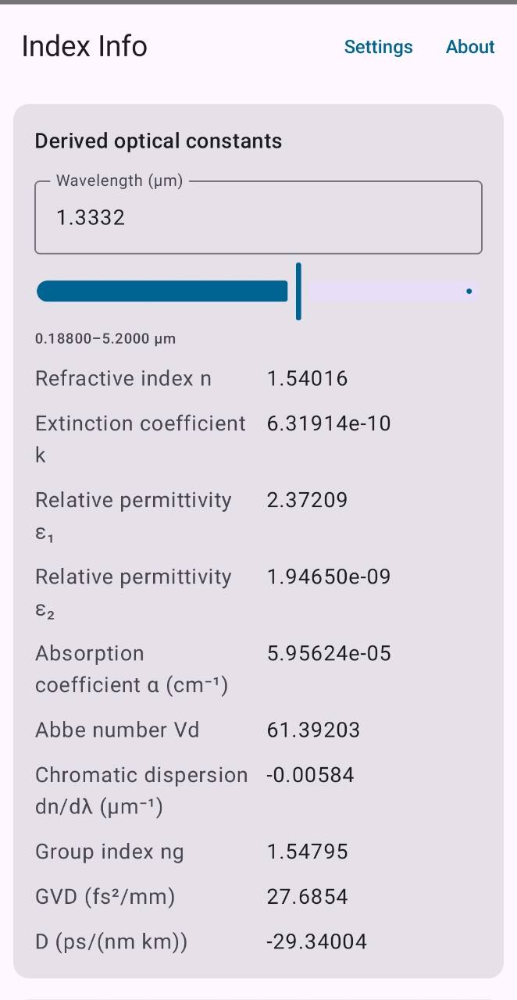

# Index Info

A mobile-first Android interface for refractiveindex.info data. It provides material selection, dispersion and extinction-coefficient plots, derived optical constants, and a Fresnel calculator.

## Screenshots

The app is designed around a compact material-selection flow and touch-friendly scientific plots.

<table>
  <tr>
    <td width="50%" align="center"><strong>Material selection</strong><br><br></td>
    <td width="50%" align="center"><strong>Dispersion and extinction</strong><br><br></td>
  </tr>
  <tr>
    <td width="50%" align="center"><strong>Fresnel reflectance</strong><br><br></td>
    <td width="50%" align="center"><strong>Derived optical constants</strong><br><br></td>
  </tr>
</table>

## Install

Download the signed APK from the [latest GitHub release](https://github.com/Xpr3ss0/RefractiveIndexApp/releases/latest). Android may ask you to allow the browser or file manager to install unknown apps. Updates installed from later releases retain app data when they are signed with the same release key.

## Data and attribution

Material data is sourced from the [refractiveindex.info database](https://github.com/polyanskiy/refractiveindex.info-database), which is dedicated to the public domain under [CC0 1.0](https://creativecommons.org/publicdomain/zero/1.0/). This is an independent application and is not affiliated with or endorsed by refractiveindex.info or M. N. Polyanskiy.

When citing this app or the included data, please cite:

> M. N. Polyanskiy, *Refractiveindex.info database of optical constants*, Scientific Data 11, 94 (2024). https://doi.org/10.1038/s41597-023-02898-2

See [DATA_SOURCES.md](DATA_SOURCES.md) and [THIRD_PARTY_NOTICES.md](THIRD_PARTY_NOTICES.md) for provenance and dependency notices.

## Development

Open the project in Android Studio or build a debug APK with:

```bash
./gradlew :app:assembleDebug
```

See [the release guide](docs/releasing.md) for signing and publishing a tagged release.

## License

This application is licensed under the [Apache License 2.0](LICENSE).
